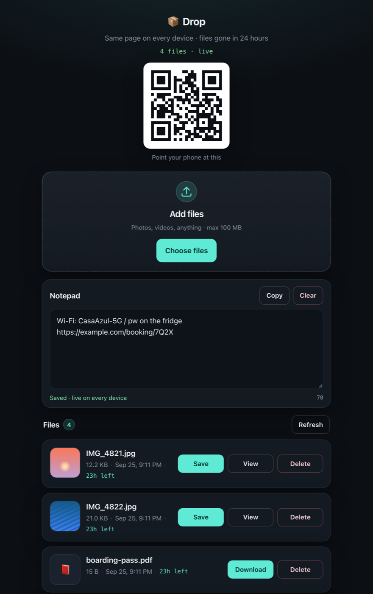

# Drop

A self-hosted shared inbox for moving files between your own devices. Open the same URL on your laptop and your phone. Upload on one and it appears on the other a few seconds later. Files delete themselves after 24 hours.

<p align="center">
  
</p>

No accounts, no per-file links, no database, no build step. It's one Node process, five dependencies, and a folder on disk.

## Features

- **Shared file list.** Every device sees the same inbox and it refreshes every 3 seconds.
- **Upload from anywhere.** Drag and drop or use the file picker, up to 10 files at once.
- **Phone-friendly saving.** On a phone, **Save to Photos** opens the system share sheet so photos and videos go straight into your camera roll.
- **Previews.** Image and video thumbnails, plus a fullscreen viewer.
- **Shared notepad.** Paste a link, code or address on one device and copy it on the other. It autosaves, syncs live and never expires.
- **QR code.** On desktop the page shows a QR code for its own URL, so you can scan it with your phone to open the same inbox. The code is generated on the server, so the URL is never sent to a third party.
- **Auto-expiry.** Files are deleted after 24 hours by default (configurable).
- **Optional password.** Set `DROP_PASSWORD` to put the whole app behind one shared password.

## Quick start

Requires Node.js 20 or newer.

```bash
git clone https://github.com/therealjohnnyb7/OPEN_FILE_DROP.git
cd OPEN_FILE_DROP
npm install
npm start
```

Open <http://localhost:3000>.

To use it from your phone on the same Wi-Fi, open the desktop browser at your computer's LAN address (for example `http://192.168.1.20:3000`) rather than `localhost`. The QR code encodes whatever address the page was opened on.

## Deploy

Drop needs a persistent disk. Uploads and the notepad are stored under `DATA_DIR`, so without a volume they'll be lost on every restart.

### Docker

```bash
docker build -t drop .
docker run -d --name drop \
  -p 3000:3000 \
  -v drop-data:/data \
  -e DROP_PASSWORD='pick-a-long-random-password' \
  drop
```

### Railway

The repo includes a `railway.json` (Dockerfile build, `/health` healthcheck).

1. Create a new project from this repo.
2. Add a volume mounted at `/data`.
3. Set `DROP_PASSWORD` in the service variables.
4. Generate a domain.

`PORT` is provided by Railway, and the Dockerfile already sets `DATA_DIR=/data`.

### Anywhere else

Any host that runs a long-lived Node process with a writable, persistent directory will work (Fly.io, Render, a VPS, a Raspberry Pi). Run **one instance only**. State lives in a JSON file on local disk, so multiple replicas won't share it.

## Configuration

All settings are environment variables. See [`.env.example`](.env.example).

| Variable | Default | Description |
|---|---|---|
| `PORT` | `3000` | HTTP port. |
| `DATA_DIR` | `./data` (`/data` in Docker) | Where uploads and `meta.json` are stored. Must be writable and persistent. |
| `DROP_PASSWORD` | *(unset)* | When set, every page and API route except `/health` requires this password (HTTP Basic auth, and any username works). |
| `MAX_FILE_BYTES` | `104857600` (100 MB) | Maximum size per file. |
| `TTL_HOURS` | `24` | How long files live before they're deleted. |
| `MAX_NOTE_CHARS` | `20000` | Maximum notepad length (hard cap 50,000). |

## Security model

Read this before you put Drop on the internet.

- **Without `DROP_PASSWORD`, the URL is the only protection.** Anyone who has it can list, download, upload and delete files and read the notepad. Hosting platforms often give out short, guessable subdomains, so set a password for any deployment that's reachable from the public internet.
- **The password is one shared secret.** There are no user accounts. Everyone who knows the password sees the same inbox. Only serve it over HTTPS, because Basic auth sends the password with every request. Login attempts aren't rate-limited, so use a long random password.
- **Uploaded files can't run code on the site.** Every file is served with `X-Content-Type-Options: nosniff` and a sandboxing `Content-Security-Policy`. Only images, video and audio are ever served inline. Everything else is forced to download.
- **There's no storage quota.** Anyone who can reach the app can upload until the disk is full. Size your volume accordingly.
- **Files are stored unencrypted** in `DATA_DIR` until they expire. The notepad never expires. Clear it yourself.
- `trust proxy` is set to one hop, which is correct behind a single reverse proxy (Railway, Fly, nginx). The only thing that uses it is the QR code's URL scheme.

## How it works

- `server.js` is an Express app. Multer writes uploads to `DATA_DIR/uploads/` under random names, and file metadata plus the notepad live in `DATA_DIR/meta.json`, which is written atomically through a temp file and rename.
- Expired files are removed on every list or read, and by a sweep that runs every 5 minutes. The sweep also deletes orphaned blobs.
- `public/` is plain HTML, CSS and JavaScript, with no framework and no bundler. Clients poll `/api/files` every 3 seconds while the tab is visible.
- File responses support HTTP range requests, which iOS Safari needs to play video.

## API

| Method | Path | Description |
|---|---|---|
| `GET` | `/api/files` | Active files, the notepad, and server limits. |
| `POST` | `/api/upload` | Multipart upload. Field name `file`, 1–10 files. |
| `GET` | `/api/file/:id` | Metadata for one file. |
| `GET` | `/api/raw/:id` | File content, inline for media and as a download otherwise. |
| `GET` | `/api/download/:id` | File content as a download. |
| `DELETE` | `/api/file/:id` | Delete a file. |
| `GET` | `/api/note` | `{ text, updatedAt, maxChars }` |
| `PUT` | `/api/note` | Body `{ "text": "..." }` replaces the notepad. |
| `GET` | `/qr.svg` | QR code for the current origin. |
| `GET` | `/health` | Liveness check. Never password-protected. |

Upload from a script:

```bash
curl -u :$DROP_PASSWORD -F "file=@photo.jpg" https://your-drop.example.com/api/upload
```

## Development

```bash
npm run dev   # restarts on changes to server.js
```

Issues and pull requests are welcome. The goal is to stay small and dependency-light, so please open an issue before starting on anything large.

## License

[MIT](LICENSE)
